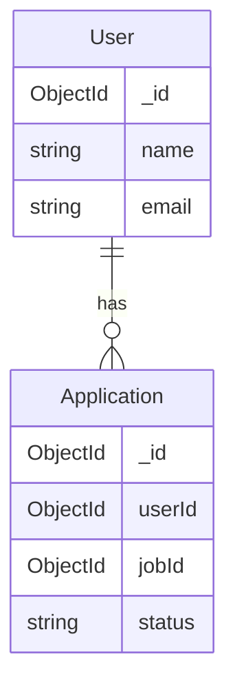
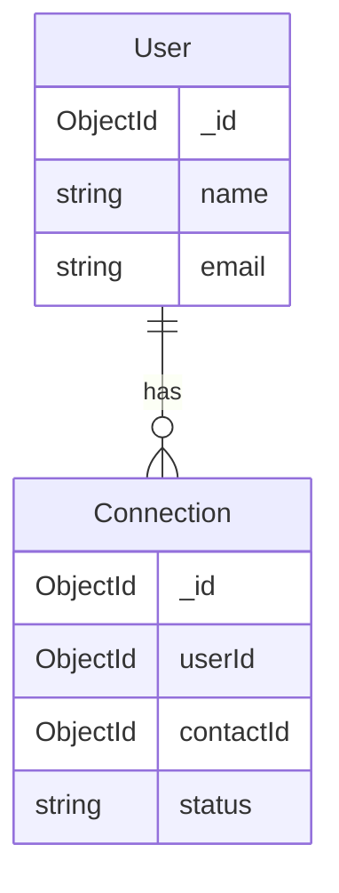

# Database Schema

## Overview
Career Path Pilot uses MongoDB as its primary database, with Mongoose as the ODM (Object Document Mapper). This document outlines the database schema, relationships, and data models.

## Schema Design

### User Collection
```typescript
interface User {
  _id: ObjectId;
  name: string;
  email: string;
  password: string;
  currentTitle: string;
  currentCompany: string;
  goalType: "new-job" | "promotion" | "skill-development";
  timeframe: "3-months" | "6-months" | "1-year";
  networkingIntensity: "low" | "moderate" | "high";
  skills: string[];
  preferences: {
    notifications: boolean;
    emailUpdates: boolean;
  };
  createdAt: Date;
  updatedAt: Date;
}
```

### Application Collection
```typescript
interface Application {
  _id: ObjectId;
  userId: ObjectId;
  jobId: ObjectId;
  status: "toApply" | "applied" | "interviewing" | "offer" | "rejected";
  applicationDate: Date;
  notes: string;
  documents: {
    resumeUrl: string;
    coverLetterUrl: string;
  };
  interviews: Array<{
    date: Date;
    type: string;
    notes: string;
    status: string;
  }>;
  createdAt: Date;
  updatedAt: Date;
}
```

### Connection Collection
```typescript
interface Connection {
  _id: ObjectId;
  userId: ObjectId;
  contactId: ObjectId;
  status: "pending" | "accepted" | "rejected";
  type: "mentor" | "peer" | "professional";
  notes: string;
  followUps: Array<{
    type: string;
    dueDate: Date;
    notes: string;
    completed: boolean;
  }>;
  createdAt: Date;
  updatedAt: Date;
}
```

### DevelopmentActivity Collection
```typescript
interface DevelopmentActivity {
  _id: ObjectId;
  userId: ObjectId;
  type: "course" | "certification" | "workshop" | "project";
  title: string;
  provider: string;
  startDate: Date;
  completionDate?: Date;
  status: "planned" | "in-progress" | "completed";
  skills: string[];
  notes: string;
  certificateUrl?: string;
  createdAt: Date;
  updatedAt: Date;
}
```

### Conversation Collection
```typescript
interface Conversation {
  _id: ObjectId;
  userId: ObjectId;
  messages: Array<{
    sender: "user" | "assistant";
    content: string;
    timestamp: Date;
  }>;
  createdAt: Date;
  updatedAt: Date;
}
```

## Indexes

### User Indexes
```typescript
UserSchema.index({ email: 1 }, { unique: true });
UserSchema.index({ skills: 1 });
UserSchema.index({ 'preferences.notifications': 1 });
```

### Application Indexes
```typescript
ApplicationSchema.index({ userId: 1 });
ApplicationSchema.index({ jobId: 1 });
ApplicationSchema.index({ status: 1 });
ApplicationSchema.index({ applicationDate: 1 });
```

### Connection Indexes
```typescript
ConnectionSchema.index({ userId: 1 });
ConnectionSchema.index({ contactId: 1 });
ConnectionSchema.index({ status: 1 });
ConnectionSchema.index({ 'followUps.dueDate': 1 });
```

### DevelopmentActivity Indexes
```typescript
DevelopmentActivitySchema.index({ userId: 1 });
DevelopmentActivitySchema.index({ type: 1 });
DevelopmentActivitySchema.index({ status: 1 });
DevelopmentActivitySchema.index({ skills: 1 });
```

## Relationships

### User-Application Relationship


### User-Connection Relationship


## Data Validation

### User Validation
```typescript
const userSchema = new Schema({
  name: { type: String, required: true },
  email: { type: String, required: true, unique: true },
  password: { type: String, required: true },
  currentTitle: { type: String },
  currentCompany: { type: String },
  goalType: { 
    type: String, 
    enum: ['new-job', 'promotion', 'skill-development'] 
  },
  timeframe: { 
    type: String, 
    enum: ['3-months', '6-months', '1-year'] 
  },
  networkingIntensity: { 
    type: String, 
    enum: ['low', 'moderate', 'high'] 
  },
  skills: [{ type: String }],
  preferences: {
    notifications: { type: Boolean, default: true },
    emailUpdates: { type: Boolean, default: true }
  }
}, { timestamps: true });
```

## Data Migration

### Migration Script Example
```typescript
const migrateUserData = async () => {
  const users = await User.find({});
  
  for (const user of users) {
    if (!user.preferences) {
      user.preferences = {
        notifications: true,
        emailUpdates: true
      };
      await user.save();
    }
  }
};
```

## Backup Strategy

### Automated Backups
```bash
# Backup script
mongodump --uri="mongodb://localhost:27017/career-dev" \
  --out="/backups/$(date +%Y%m%d)" \
  --gzip
```

### Restore Process
```bash
# Restore script
mongorestore --uri="mongodb://localhost:27017/career-dev" \
  --gzip \
  "/backups/20240101"
```

## Performance Considerations

### Query Optimization
1. Use appropriate indexes
2. Implement pagination
3. Use projection to limit returned fields
4. Implement caching for frequently accessed data
5. Use aggregation pipeline for complex queries

### Data Consistency
1. Implement atomic operations
2. Use transactions for multi-document operations
3. Implement proper error handling
4. Use validation middleware
5. Implement proper indexing strategy

## Future Considerations

### Schema Evolution
1. Implement versioning for schema changes
2. Plan for backward compatibility
3. Document migration strategies
4. Consider data archiving
5. Plan for data partitioning

### Scaling Strategy
1. Implement sharding
2. Consider read/write splitting
3. Plan for horizontal scaling
4. Implement proper indexing
5. Consider data archiving strategy 