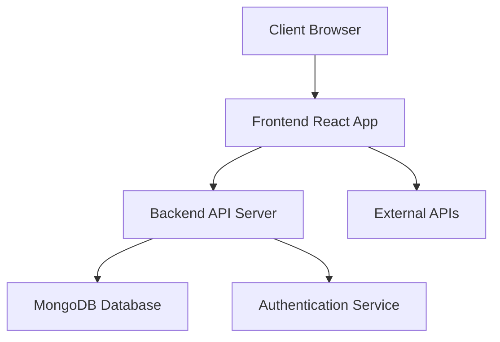
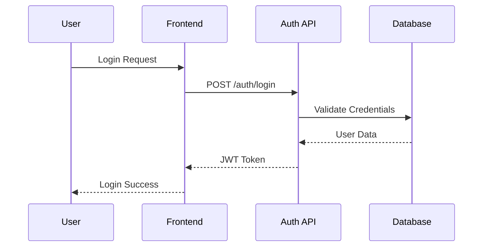
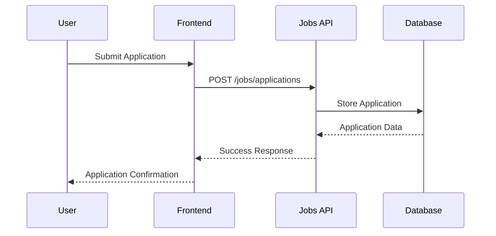

# System Architecture

## Overview
Career Path Pilot is a full-stack application built with modern web technologies. This document outlines the system's architecture, components, and their interactions.

## Tech Stack

### Frontend
- React + TypeScript
- Vite (Build Tool)
- Tailwind CSS + shadcn/ui (Styling)
- React Query (State Management)
- React Router (Routing)

### Backend
- Node.js + TypeScript
- Express.js (Web Framework)
- MongoDB (Database)
- JWT (Authentication)

## System Components

## Key Features

### 1. User Management & Authentication
- User registration and login
- Profile management
- Role-based access control
- Session management

### 2. Job Search & Application Tracking
- Job search functionality
- Application tracking
- Interview scheduling
- Document management

### 3. Professional Networking
- Contact management
- Follow-up tracking
- Connection suggestions
- Communication tools

### 4. Career Development Planning
- Skill tracking
- Learning resource management
- Progress monitoring
- Goal setting

### 5. Business Marketplace
- Company profiles
- Job listings
- Application management
- Business networking

### 6. AI-powered Career Assistant
- Career guidance
- Interview preparation
- Resume optimization
- Skill recommendations

## Data Flow

### Authentication Flow

### Job Application Flow

## Security Architecture

### Authentication
- JWT-based authentication
- Secure password hashing
- Session management
- Token refresh mechanism

### Authorization
- Role-based access control
- Resource-level permissions
- API endpoint protection
- Data access control

### Data Protection
- Input validation
- Output sanitization
- Secure headers
- CORS configuration

## Performance Considerations

### Frontend
- Code splitting
- Lazy loading
- Image optimization
- Caching strategies

### Backend
- API response caching
- Database indexing
- Query optimization
- Rate limiting

## Monitoring & Logging

### Frontend
- Error tracking
- Performance monitoring
- User analytics
- Usage patterns

### Backend
- Request logging
- Error tracking
- Performance metrics
- Security monitoring

## Deployment Architecture

### Development
- Local development environment
- Hot reloading
- Development database
- Mock services

### Production
- Containerized deployment
- Load balancing
- Database replication
- CDN integration

## Future Considerations

### Scalability
- Horizontal scaling
- Database sharding
- Caching strategies
- Microservices architecture

### Extensibility
- Plugin system
- API versioning
- Feature flags
- Modular architecture 